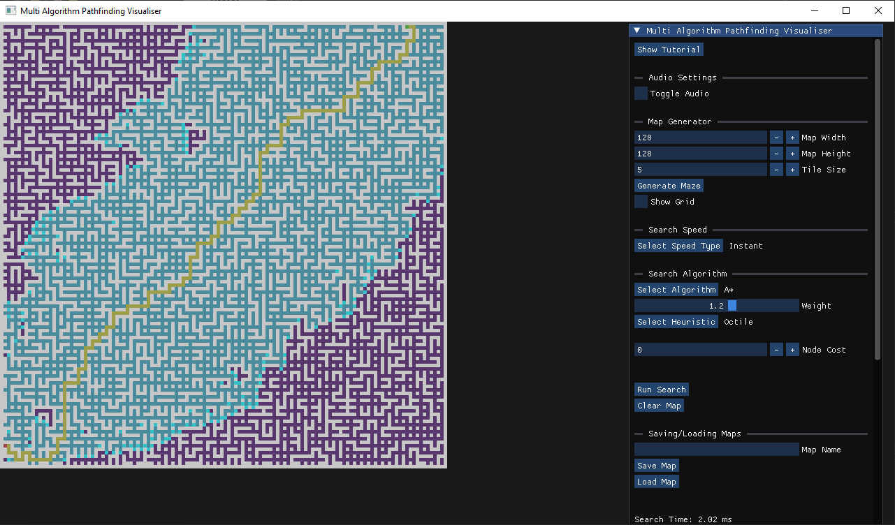
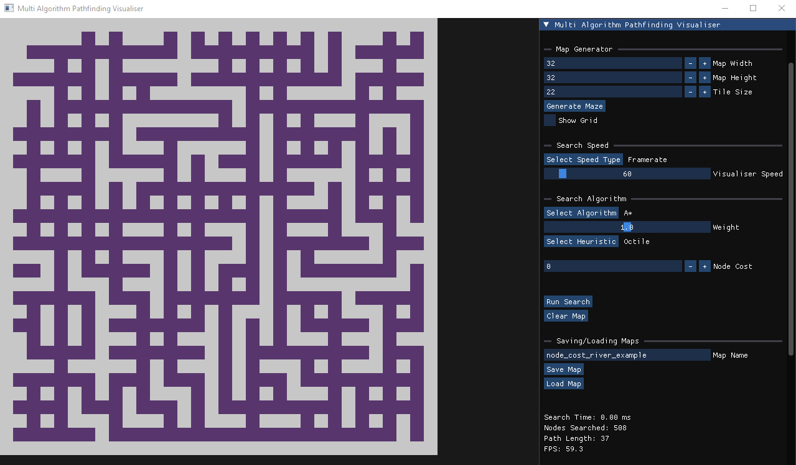
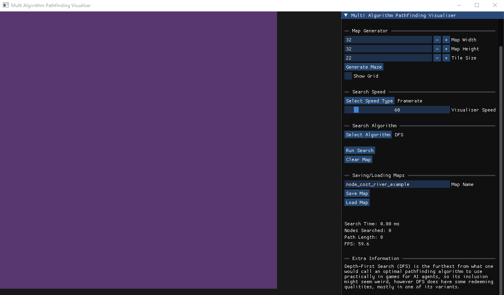
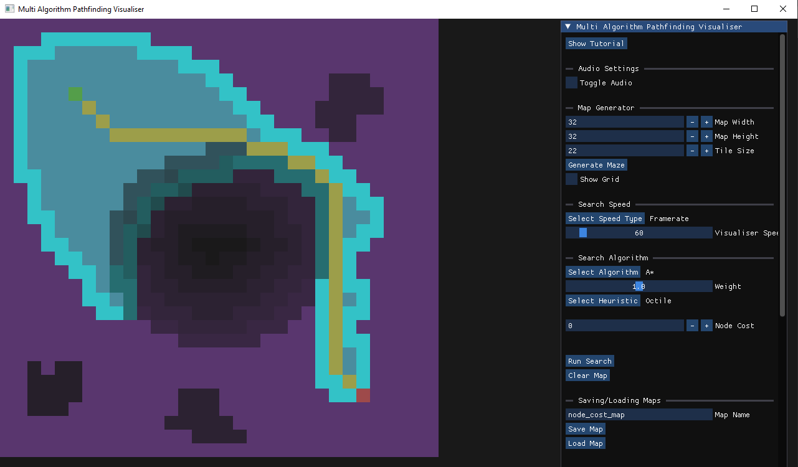
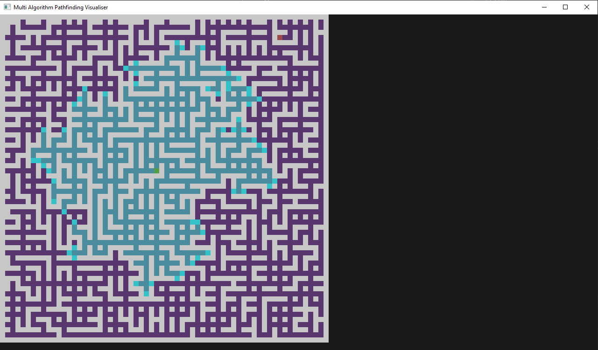
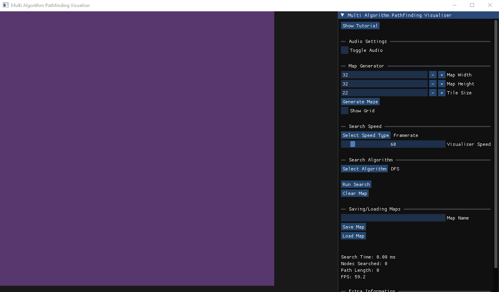

# Multi Algorithm Pathfinding Visualiser (MAPV)

MAPV is a simple yet comprehensive visualiser for search algorithms used in games and other programs that use pathfinding for navigating agents around an environment.

 





## Pre-built binaries for Windows & Linux
https://sweetnerevar.itch.io/mapv

# Build Instructions
```
git clone https://github.com/SweetNerevar-hub/multi-algorithm-pathfinding-visualiser.git
cd multi-algorithm-pathfinding-visualiser
```

## Windows Users
### Visual Studios / MSVC
```
cmake -S . -B build
cmake --build build --target MAPV --config Release
```

### MinGW
```
cmake -S . -B build -G "MinGW Makefiles" -D CMAKE_BUILD_TYPE=Release
cd build && mingw32-make MAPV
```

### Clang-CL
```
cmake -S . -B build -T "ClangCL"
cmake --build build --target MAPV --config Release
```
Note: You will get alot of warnings about Colour.h when compiling with clang.

## Linux Users
GLFW has dependencies on X11 and Wayland. <br>
So before building, make sure you install those package if you haven't already.

### X11
On Debian and derivatives like Ubuntu and Linux Mint:
```
sudo apt install xorg-dev
```

### Wayland
On Debian and derivatives like Ubuntu and Linux Mint:
```
sudo apt install libwayland-dev libxkbcommon-dev wayland-protocols
```
I've listed the commands for installing on Debian-like distros, as this is what I've used to test.

For more information, visit the GLFW site on compiling the library:
https://www.glfw.org/docs/3.3/compile.html#compile_deps

<br>

```
cmake -S . -B build
cd build && make MAPV
```

## Running the Program
```
cd build
./MAPV
```
### If built to VS
```
cd release && ./mapv
```
Alternatively: Navigate to the build (build/Release if built to VS) folder and run the MAPV executable. All necessary resources get copied to the folder post-build.
